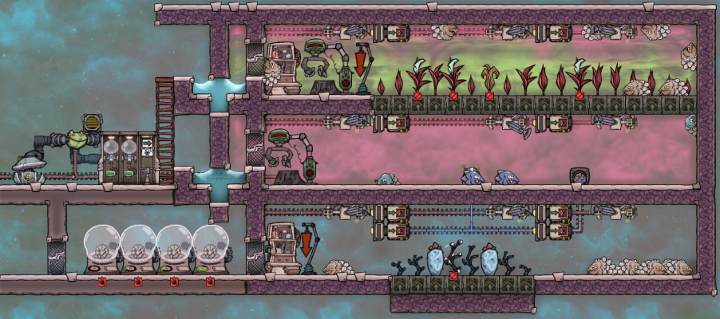
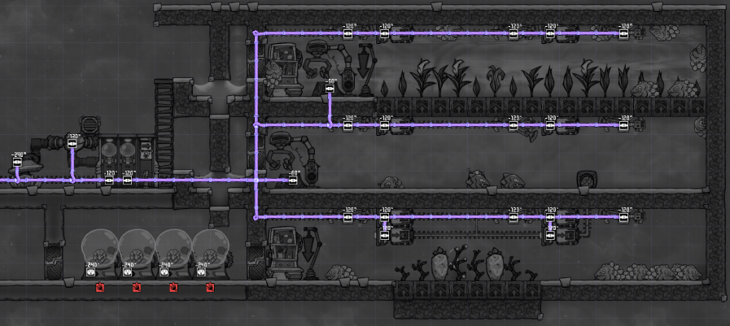
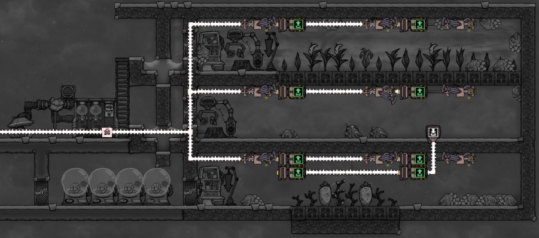

# Oxygen Not Included - Drekko farm for plastics

[YouTube - Drecko Ranching Tutorial](https://www.youtube.com/watch?v=2RhoyFAjYSg).

In "Oxygen Not Included," a Drekko farm for plastics involves breeding and maintaining Drekko creatures in a specialized farm environment to harvest their scales, which can be refined into plastic. Drekko creatures naturally grow scales that, when sheared, yield Reed Fiber or Plastic, depending on their diet and the variant of Drekko. By feeding them a specific diet (usually Balm Lily or Mealwood) in a controlled environment, players can efficiently farm these materials, especially plastic, which is a valuable resource for advanced construction and manufacturing in the game.

To set up and run a successful Drekko farm for plastics in "Oxygen Not Included," you need to follow these steps:

1. **Food Source**: Drekko feed on specific plants. Depending on the type of Drekko, you will need to grow Mealwood, Balm Lily, or Pincha Pepper plants within the enclosure. The type of food they consume influences the type of scale they produce. For plastic production, you want to evolve your Drekko into a Glossy Drekko, which requires feeding them Mealwood.

2. **Breeding Drekko**: You'll need to capture wild Drekko using traps and transport them to your farm. Once in the farm, Drekko will breed if they are happy and well-fed. Ensure that the environment meets their needs for temperature, atmosphere, and food.

3. **Glossy Drekko Evolution**: Regular Drekko will not produce plastic. They need to evolve into Glossy Drekko. This is achieved by ensuring they have a diet of Mealwood. Over time, as they consume this diet, there's a chance they will lay Glossy Drekko eggs.

4. **Shearing Station**: Build a shearing station within the enclosure. When Drekko's scales are fully grown, your Duplicants can shear them. The shearing process in Glossy Drekko will yield Plastic directly, which is a valuable and versatile resource in the g4me.

5. **Managing the Farm**: Regularly monitor your Drekko population, the availability of food, and the hydrogen environment to ensure continuous plastic production. Overpopulation can lead to food shortages, so managing the number of Drekko is important.

By following these steps, you can establish a sustainable farm that produces plastic, reducing the need to rely on petroleum-based plastic production methods. This method is eco-friendlier and can be a crucial part of your colony's resource management strategy in "Oxygen Not Included."

Example:

Power Overlay:

Conveyor Overlay:

