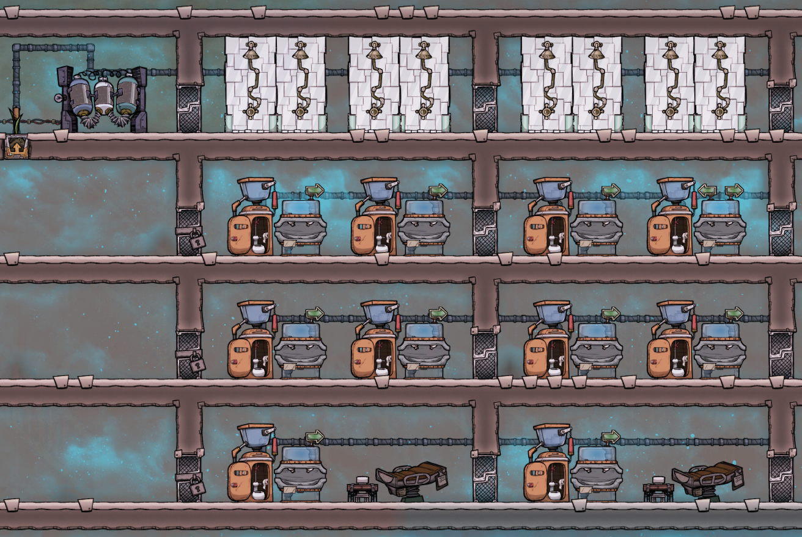
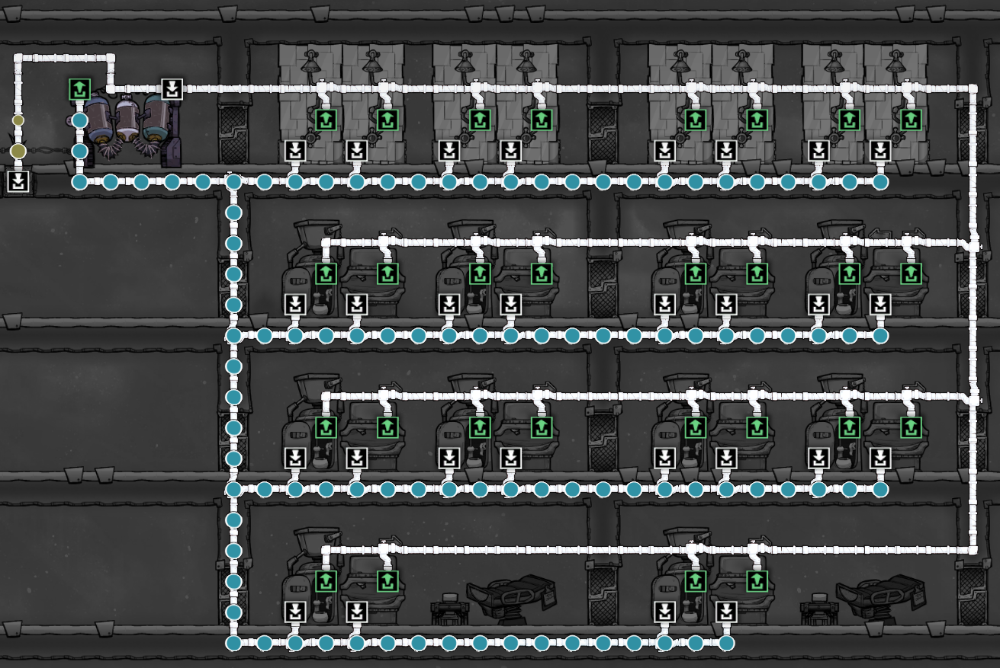

# Oxygen Not Included - Infinite Bathrooms

[YouTube - Tutorial Bites - (Infinite) Bathrooms](https://www.youtube.com/watch?v=uI-ijaPAxQM).

In "Oxygen Not Included" the concept of "Infinite Bathrooms" refers to a clever in-game strategy to efficiently manage the bathroom needs of your colonists (known as Duplicants) without overburdening your water resources.

Here's a basic explanation of how it works:

1. **Looped Water System**: The strategy typically involves creating a closed-loop system where the water used in the bathrooms is cleaned and recycled. This setup often includes lavatories (toilets) and sinks, which produce polluted water as waste.

2. **Water Sieve**: The polluted water is then sent to a Water Sieve, which purifies it. The Water Sieve converts polluted water back into clean water, which can then be reused in the bathrooms again.

3. **Germs Management**: An important aspect of this setup is managing germs, as the Water Sieve does not remove germs from the water. This is typically handled by ensuring that the water loop only services the bathrooms and does not mix with the colony's main water supply.

4. **Efficient Use of Resources**: This setup is considered 'infinite' in the sense that it allows the Duplicants' bathroom needs to be met without continuously consuming fresh water resources. It's a sustainable solution that helps in resource management, especially important in the challenging environment of the game.

Example:

Plumbing:

