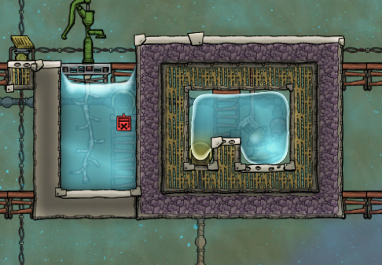
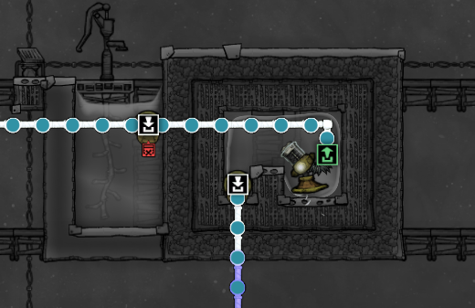
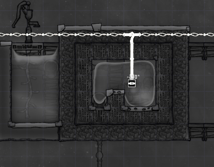

# Oxygen Not Included - Infinite Water Storage

Infinite water storage refers to a method of storing an unlimited amount of water in a confined space using game mechanics. 
This is achieved by exploiting the way the game handles liquid and gas physics. The basic principle involves stacking water (or any liquid) in a single tile to surpass its normal capacity, typically by using a liquid vent submerged in a small amount of another liquid, such as water, in an enclosed space. When more water is pumped into this tile than it can normally hold, the game's physics do not allow the extra water to spill out, effectively creating a tile that can hold an infinite amount of water. This technique is valuable for managing large water reserves without requiring extensive space.

Example:

Plumbing:

Power Overlay:

